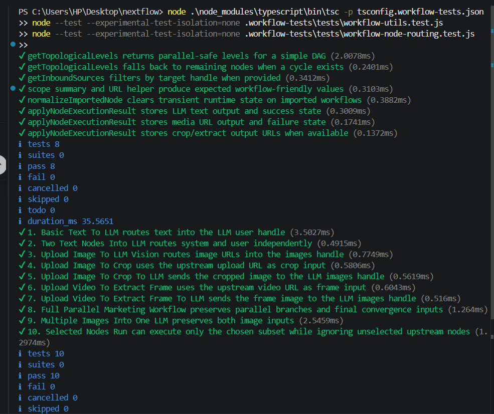

### NextFLOW

## Project setup

Clone the repository:

```bash
git clone https://github.com/uchiha-vivek/NextFlow.git .
```

Install dependencies:

```bash
npm install
```

Create your environment file from the example and fill in the real values:

```bash
cp .env.example .env
```

PowerShell equivalent:

```powershell
Copy-Item .env.example .env
```

Required services and keys:

- PostgreSQL database via `DATABASE_URL`
- Clerk keys for auth
- Azure OpenAI credentials
- Transloadit credentials and template IDs
- Trigger.dev secret key
- Gemini API key

If `ffmpeg` and `ffprobe` are not available on your PATH, set `FFMPEG_PATH` and `FFPROBE_PATH` in `.env`.

Apply the Prisma migration before starting the app:

```bash
npx prisma migrate deploy
```

For local development, if you want Prisma to also track local schema changes in a dev database, you can use:

```bash
npx prisma migrate dev
```

Start the Next.js app:

```bash
npm run dev
```

Run Trigger.dev in a separate terminal:

```bash
npx trigger.dev@latest dev
```

## Build

The production build already runs Prisma migration + client generation first:

```bash
npm run build
```

## Tests

Run the workflow test suite from the repo root:

```bash
npm run test:workflows
```

Run a single workflow test manually:

```bash
node .\node_modules\typescript\bin\tsc -p tsconfig.workflow-tests.json
node --test --experimental-test-isolation=none .workflow-tests\tests\workflow-node-routing.test.js
```

#### Screenshot of Test Case

<p align="center">
  <a href="">
    
  </a>
</p>


## Text and LLM workflow


[Loom video](https://www.loom.com/share/07835b433a0a4075878ec381f225be5c)


## Image uploading, Cropping and LL workflow 


[Loom Video](https://www.loom.com/share/9aa3215a6c814841b131c54001aab38d)


## Some Initial future enhancements

1. Including evlogs and consuming through the axiom or OpenTelemetry
2. Rate limiting middleware with the help of clerk
3. Guard on File size upload
4. Cleaning up old workflow history
5. Including JS docs for all the functions
6. Cron Jobs for user credit management

[Loom video for enhancements](https://www.loom.com/share/ecfe59e21a7e45c4b7fe5523adb0d036)

